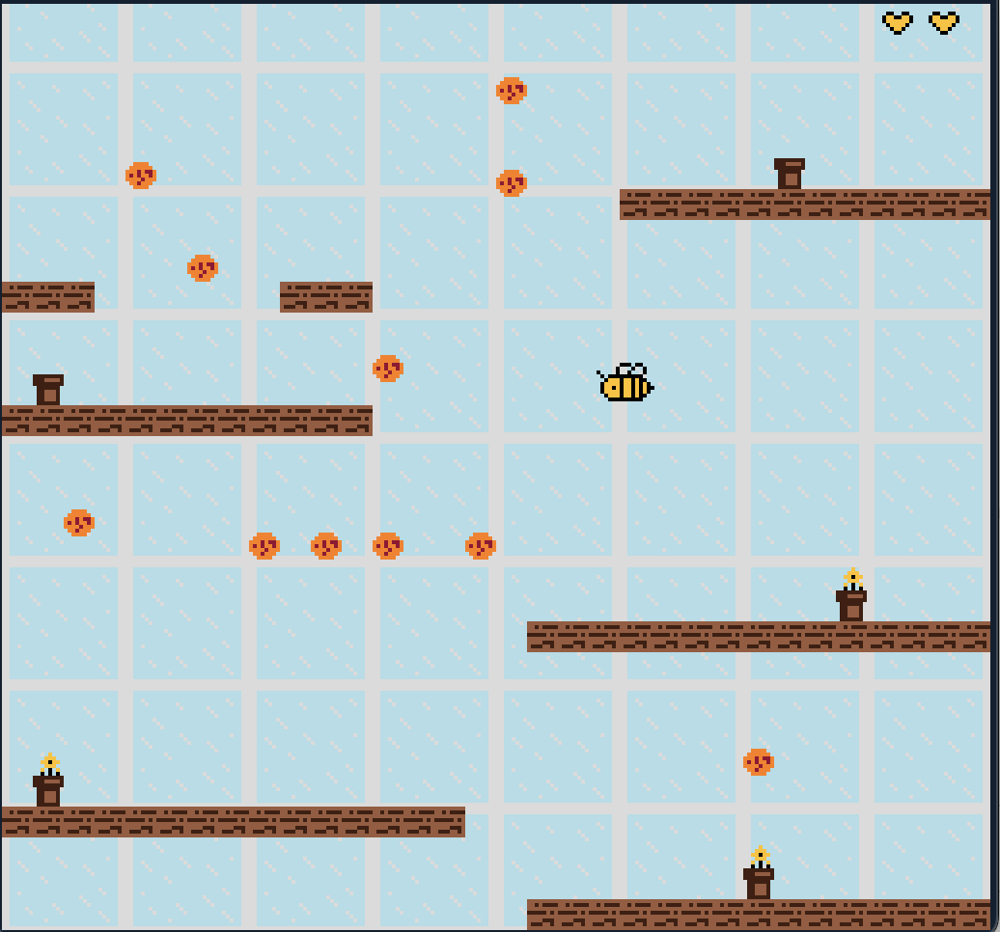

# Busy Bee

Author: Sara Pavlinek

Design: A game where you control a bee navigating through a glass greenhouse filled with toxic bubbles. The objective is for the bee to grow flowers from pots, creating a garden while avoiding the toxic bubbles.

Screen Shot:

How Your Asset Pipeline Works:

The game uses a asset pipeline that converts PNG tilesets into PPU466-compatible data:
1. Source tileset (`game1_tileset.png`) contains all game sprites arranged in an 8x8 tile grid
2. The `build_assets.cpp` tool processes the PNG file and extracts tile data and palette information
3. Output is saved as `game1_tileset.dat` containing tile table and palette table data
4. At runtime, `AssetLoader` loads the binary data directly into the PPU466's tile and palette tables

The tileset includes animated bee sprites, enemy bubbles, environmental objects (wood, pots, flowers, hearts), and text tiles for the game over screen.

How To Play:

Controls:
- Arrow Keys: Move the bee (up, down, left, right)
- 'A' Key: Interact with pots to grow flowers
- 'R' Key: Restart game (when game over)

Gameplay:
- You start with 3 hearts - lose one heart each time you touch an enemy
- Wooden shelves block your movement and must be flown around
- Press 'A' near pots to spawn flowers above them
- Enemies patrol in fixed patterns (stationary, horizontal, or vertical movement)
- Game over when all hearts are lost - press 'R' to restart

This game was built with [NEST](NEST.md).

